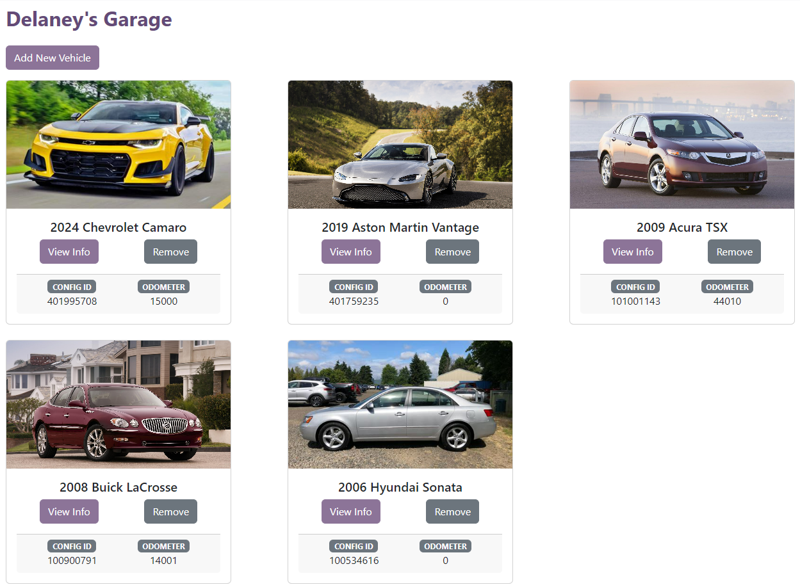
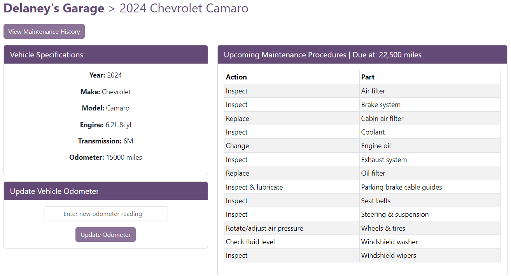
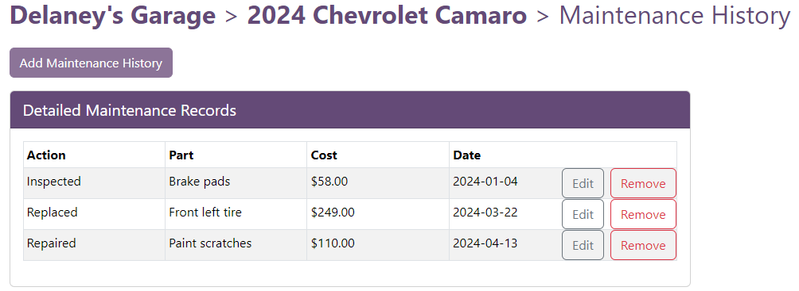

# Driveline

#### A predictive vehicle maintenance system for our Capstone Project in the Winter 2024 semester.

## Description:
Driveline is a web application designed to streamline and automate the process of vehicle maintenance tracking and notification. The primary goal of this application is to provide users with timely alerts regarding recommended upcoming maintenance tasks for their vehicles. Additionally, users will have access to their personalized 'Garage', where they can upload, manage, and view maintenance information about the vehicles they own.

---

## Key Features:
- [x] **OAuth Login Page:** Utilizes OAuth for secure login, enabling users to create profiles seamlessly.
- [x] **Vehicle Management:** Users can upload, edit, and remove vehicles from their Garage with ease.
- [x] **Service History & Upcoming Services:** Users can save & view their service history, upcoming maintenance recommended maintenance, and general vehicle information when selecting a vehicle in their garage.

## Technologies:
- Frontend: HTML/CSS, JavaScript, React, Bootstrap
- AWS: Lambda (for API functions), S3 (for site hosting), API Gateway (for API routing),  Cloudfront/Route 53 (for domain routing)
- Local Development: Node.js
- Database: MongoDB
- Authentication: OAuth

## Privacy Policy:
By using Driveline, you accept the terms stated under our [Privacy Policy](privacy-policy.md).

## Screenshots:

